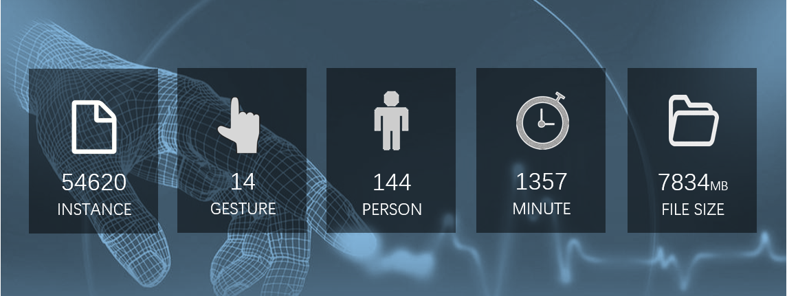
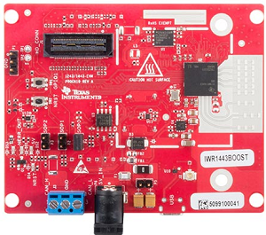
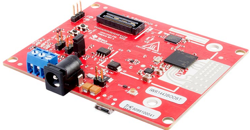
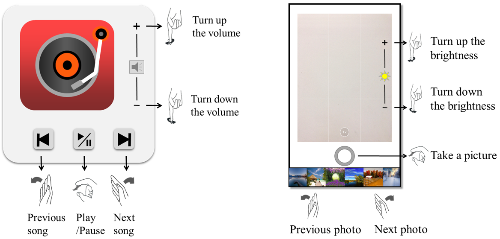
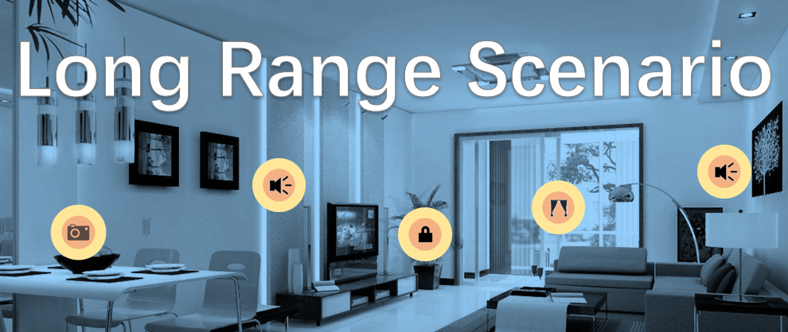

# mmWave-gesture-dataset

# OVERVIEW

This dataset is the first mmWave gesture dataset so far and it has several advantages:   
* 2 scenarios: short range (i.e. Human-Radar Distance(HRD) < 0.5 m) and long range (i.e. 2m < HRD < 5m);   
* large amount and long last time: 56,420 traces, with 1,357 minutes in total;   
* scores of people: 144 people (including 64 men and 80 women);   
* various types of gesture data: not merely PRM information, but also some raw signal data, raw Range-Doppler images and SEP’s cloud.   
* extensive study: not merely directly sensing, but also sensing with certain blockages (e.g. paper, corrugated paper, metal board).

Following we introduce the theroy principle of mmWave radar, the advantages of mmWave sensing, and the implementation details of this dataset.

# RADAR PRINCIPLE

We capture human gestures by utilizing FMCW (frequency modulated continuous wave) signals which is a mature method in the field of radar detection. It has unique properties to obtain information about reflection points, such as their position and velocity. Therefore, it can record the change patterns of different gestures by converting the signals reflected at different positions of the hand into motion information in three-dimensional space. Specifically, the FMCW signal can obtain the distance of the reflector from the radar by mixing the received signal, then analyze the phase change of the signal of the point at that distance to obtain the speed of this point. Finally, the angle information is obtained by the phase difference between the reflected signal at different two-dimensional Rxs.

# ADVANTAGES of MMWAVE

## Potential in 5G era

As we all know, the emerging 5G technology is based on mmWave frequency bands. Due to its short wavelength, mmWaves have the following two advantages when sensing the surrounding environment: high-precision (cm-level ranging ability) and fine sensitivity (can monitor movements at the fractional millimeter level). Based on these advantages, the current work not only "sees" the indoor wall structure through a 5G commercial network card, but also "recognizes" different human movements through a specific FMCW radar.
It is exciting that the recent smartphone Google Pixel4 has been equipped with a mmWave FMCW radar module to implement relatively simple gestures "in air" to control music players and other functions. This means that this function is gradually showing the powerful capabilities of mmWave signals in addition to high-speed transmission in the 5G era. However, according to the current research, there are still some problems that need to be solved urgently, such as concurrent gestures and power consumption.

## "See-through" ability

The millimeter wave can be used when blocking by nonconductor materials (such as cloth or plastic), which is determined by the nature of the mmWave. Because when the signal penetrates these objects, these materials will only change the amplitude of the signal and consume its energy, and will not affect the signal change pattern that records a certain action. In other words, the blocking of these materials will not affect the ability of the mmWave to capture action, when a certain signal strength is guaranteed. In addition, compared to cameras with similar recognition accuracy and infrared 3D structured light, mmWave is deficient of fine-grained imaging of the detected objects, thereby protecting personal privacy and safe use. Furthermore, compared with the recognition technology of sound wave, ultrasonic wave and Wi-Fi frequency band, mmWave FMCW radar has more accurate detection ability, so that it can recognize more delicate human actions.

## Free to the effect of surroundings

Compared with sonic, ultrasonic wave and Wi-Fi frequency band signals, it is convenient for mmWave signal to eliminate the adverse effects of static objects in the surrounding environment. 
First of all, there is no need to worry about the reflection of static objects: because the FMCW reflected signal of static objects after mixing, its influence is a constant frequency that does not change with time, so it is easy to be eliminated by simple subtraction of adjacent time slices. eliminate. 
Secondly, also no need to worry about the signal effects caused by multiple-time reflections: based on the common sense of optoelectronic physics, the attenuation of electromagnetic waves on the propagation path is proportional to the square of its transmission distance. Therefore, its energy intensity will be severely reduced, after the reflection signal of a dynamic object is reflected by the static object multiple times, not to mention that each reflection of the signal will also cause serious energy attenuation (especially for the mmWaves). As a result, these very weak "multipath reflections" are convenient to be submerged by general noises. To ensure the exclusion, we also applied the mature CFAR-CASO algorithm in the field of signal processing to filter the weak effects of multi-path reflections.

# DATASET IMPLEMENTATION

In this mmWave gesture dataset, we utilize the TI-IWR1443 single-chip 76-GHz to 81-GHz mmWave sensor evaluation module. Since the gestures we recorded were completed in two scenarios, we set different parameters for the radar for different scenes, which will be introduced following.

## Short range scenario

Specifically, in the short range scenario, the same with M-Gesture, we invited 131 people (including 60 men and 71 women) to perform five groups of gestures, 30,360 traces in total. Not only the predesignated gestures but numbers of unexpected motions are provided, e.g. fingers’ motions and English letters’ writing. 

This dataset has been separated into 4 parts as following:   
* Eigenvalue squences (M-Gesture’s training and validating dataset)   
Gestures are transformed by 10 eigenvalues which is same as the PRM's in M-Gesture.
These eigenvalues conclude the detected points' overall variation trend, e.g. total number, velocity, distance and angle of arrival.  
  * **Folder**: /gesture_dataset/short_range_gesture/short_PRMinfo
  * **Containing**: 44 people (22 men & 22 women) which perform 5 gestures (Some of them for 2 or 3 gestures) for 15 times (Some of them for 30 or 50 times).
  * **Gesture class**: Corresponding to the words in M-Gesture, 'knock’ is dual knocking, 'lswipe’ is left swiping, 'rswipe’ is right swiping, 'clock’ is clockwise rotating, 'anticlock’ is counterclockwise rotating.  All of them are shown in the example demonstrations.    
  * **Form**: gesture_`name`_ hand_short_center_`sort`_`number`.txt, where `name` represents the initials of each volunteer, `sort` represents the class name of different gestures (i.e. 'knock’, 'lswipe’, 'rswipe’, 'clock’ and 'anticlock’), `number` represents the sequence number of each gesture.

* Other gestures with the same 10 eigenvalues  
  * **Folder**: /gesture_dataset/short_range_gesture/short_PRMinfo_other
  * **Containing**: 60 people (26 men and 34 women) which perform 5 of the 10 gestures for 50 times, and 27 people (12 men and 15 women) each of which perform 390 unexpected motions.
  * **Gesture class**: The last 5 classes and new 5 classes (i.e. 'finger_ rub’, 'finger_slide’, 'hit_finger’, 'pinch_index’, 'pinch_pinky’ and all of them are shown in the example demontrations).  
  * **Form**: short_point_`id`_ `sort`_ `number`.txt, where `id` represents the id number of each volunteer, `sort` represents the class name of different gestures (i.e. the above 5 gestures and 'finger_ rub’, 'finger_slide’, 'hit_finger’, 'pinch_index’, 'pinch_pinky’), `number` represents the sequence number of each gesture.  
  * In this part, we also collected some gestures behind certain blockage, e.g. paper and corrugated paper.  
  ** **Form**: short_paperpoint_`id`_ `sort`_ `number`.txt ***or*** short_corrpoint_`id`_ `sort`_ `number`.txt.

* Range-Doppler image  
  * **Folder**: /gesture_dataset/short_range_gesture/short_RangeDoppler  
  * **Containing**: 15 people (8 men and 7 women) which perform 5 of the 10 gestures for 10 or 15 times, and some unexpected motions.
  * **Gesture class**: 'knock’, 'lswipe’, 'rswipe’, 'clock', 'anticlock' and 'unex’. All of them are shown in the example demonstrations. 'unex' represents the unexpected motions for avoiding mis-recognition.   
  * **Form**: short_RD_`id`_ `sort`_ `number`.mp4, where `id` represents the id number of each volunteer, `sort` represents the class name of different gestures (i.e. 'knock’, 'lswipe’, 'rswipe’, 'clock’ and 'anticlock’), `number` represents the sequence number of each gesture.  

* Raw signal data (with 4 Rxs)  
  * **Folder**: /gesture_dataset/short_range_gesture/short_raw  
  * **Containing**: 1 people which perform 10 gestures for 50 times, and 5 people for English letters writing.  
  * **Gesture class**: 'knock’, 'lswipe’, 'rswipe’, 'clock', 'anticlock',  'finger_ rub’, 'finger_slide’, 'hit_finger’, 'pinch_index’, 'pinch_pinky’ and 'unex’. All of them are shown in the example demonstrations. 'unex' represents the unexpected motions for avoiding mis-recognition.   
  * **Form**: short_raw_`id`_ `sort`_ `number`.mat, where `id` represents the id number of each volunteer, `sort` represents the class name of different gestures (i.e. 'knock’, 'lswipe’, 'rswipe’, 'clock’, 'anticlock’, 'finger_rub’, 'finger_slide’, 'hit_finger’, 'pinch_index’, 'pinch_pinky’ and 'unex’), `number` represents the sequence number of each gesture.  

## Long range scenario

In the long range scenario, we invited 100 people (including 44 men and 56 women) to perform the same five gestures (i.e. left swiping, right swiping, knocking, rotating and some unexpected motions), 26,060 traces in total.

* Point Cloud  
Point cloud are the detected points with their spatial location, velocities and reflection intensity.
  * **Folder**: /gesture_dataset/short_range_gesture/long_SEP  
  * **Containing**: 79 people (35 men and 44 women) which perform 4 gestures for 50 times, and 11 people (5 men and 6 women) which perform 300 unexpected motions.  
  * **Gesture class**: 'knock’, 'lswipe’, 'rswipe’, 'rotate’ and 'unex’. All of them are shown in the example demonstrations.  
  * **Form**: long_point_`id`_ `sort`.csv, where `id` represents the id number of each volunteer, `sort` represents the class name of different gestures (i.e. 'knock’, 'lswipe’, 'rswipe’, 'rotate’ and 'unex’).  
  * **Data structure**: The data structure of each gesture is 7* n, where n is various with frames and 7 are 'frame id’, 'detected points in each frame’, 'x coordinate of each point’, 'y coordinate of each point’, 'z coordinate of each point’, 'velocity of each point’ and 'reflection intensity of each point’. In each '.csv’ file, there are at least 50 gesture, and these gestures can be divided by a large interval between each two of them.
  * **Notice**:  In each CSV file, the lost frames are the delimiters among different actions of the same gesture. We asked the volunteers to hold still for about 1 second after each action so as to generate empty frames, and then use these frames as delimiters between each action.

  
* Raw signal data    
  * **Folder**: /gesture_dataset/short_range_gesture/long_raw  
  * **Containing**: 10 people (4 men and 6 women) which perform the same 4 gestures for 50 times.  
  * **Gesture class**: 'knock’, 'lswipe’, 'rswipe’, 'rotate’ and 'unex’. All of them are shown in the example demonstrations.  
  * **Form**: long_raw_`id`_ `sort`_ `number`.mat, where `id` represents the id number of each volunteer, `sort` represents the class name of different gestures (i.e. 'knock’, 'lswipe’, 'rswipe’, 'rotate’ and 'unex’), `number` represents the sequence number of each gesture.  
  * **Data structure**: The data structure of each gesture is 512* 2* 5* 100, where 512 is the range bins, 2 is the id of receiving antenna, 5 is the doppler bins, and 100 is the frame id.
  
# Example demonstration
Before performing gestures, volunteers are asked to watch the example demonstrations of each gesture and the example demonstrations are available in the folder "`/gesture_dataset`".
