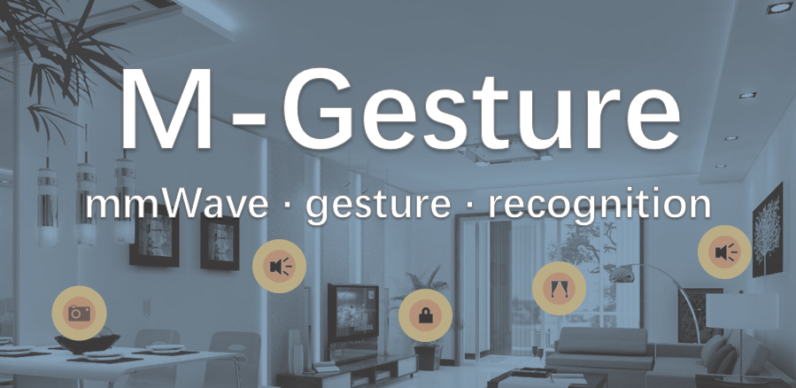
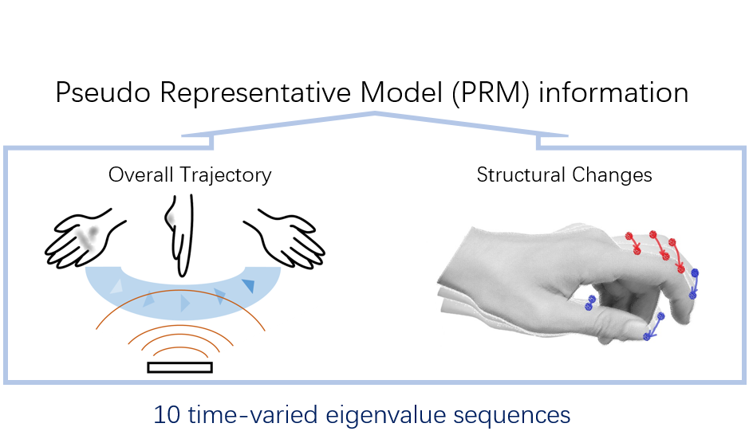

# mmWave-gesture-dataset

# OVERVIEW

This dataset is the first mmWave gesture dataset so far and it has several advantages:   
(i) 2 scenarios: short range (i.e. Human-Radar Distance(HRD) < 0.5 m) and long range (i.e. 2m < HRD < 5m);   
(ii) large amount and long last time: 56,420 traces, with 1,357 minutes in total;   
(iii) scores of people: 144 people (including 64 men and 80 women);   
(iv) various types of gesture data: not merely PRM information, but also some raw signal data, raw Range-Doppler images and SEP’s cloud.   
(v) extensive study: not merely directly sensing, but also sensing with certain blockages (e.g. paper, corrugated paper, metal board).

## Short range scenario
Specifically, in the short range scenario, the same with M-Gesture, we invited 131 people (including 60 men and 71 women) to perform five groups of gestures, 30,360 traces in total. Not only the predesignated gestures but numbers of unexpected motions are provided, e.g. fingers’ motions and English letters’ writing. 

This dataset has been separated into 4 parts as following:   
* Eigenvalue squences (M-Gesture’s training and validating dataset)   
Gestures are transformed by 10 eigenvalues which is same as the PRM's in M-Gesture.
These eigenvalues conclude the detected points' overall variation trend, e.g. total number, velocity, distance and angle of arrival.  
  * **Folder**: /gesture_dataset/short_range_gesture/short_PRMinfo
  * **Containing**: 44 people (22 men & 22 women) which perform 5 gestures (Some of them for 2 or 3 gestures) for 15 times (Some of them for 30 or 50 times).
  * **Gesture class**: Corresponding to the words in M-Gesture, 'knock’ is dual knocking, 'lswipe’ is left swiping, 'rswipe’ is right swiping, 'clock’ is clockwise rotating, 'anticlock’ is counterclockwise rotating.  All of them are shown in the example demonstrations.    
  * **Form**: gesture_`name`_ hand_short_center_`sort`_`number`.txt, where `name` represents the initials of each volunteer, `sort` represents the class name of different gestures (i.e. 'knock’, 'lswipe’, 'rswipe’, 'clock’ and 'anticlock’), `number` represents the sequence number of each gesture.

* Other gestures with the same 10 eigenvalues  
  * **Folder**: /gesture_dataset/short_range_gesture/short_PRMinfo_other
  * **Containing**: 60 people (26 men and 34 women) which perform 5 of the 10 gestures for 50 times, and 27 people (12 men and 15 women) each of which perform 390 unexpected motions.
  * **Gesture class**: The last 5 classes and new 5 classes (i.e. 'finger_ rub’, 'finger_slide’, 'hit_finger’, 'pinch_index’, 'pinch_pinky’ and all of them are shown in the example demontrations).  
  * **Form**: short_point_`id`_ `sort`_ `number`.txt, where `id` represents the id number of each volunteer, `sort` represents the class name of different gestures (i.e. the above 5 gestures and 'finger_ rub’, 'finger_slide’, 'hit_finger’, 'pinch_index’, 'pinch_pinky’), `number` represents the sequence number of each gesture.  
  * In this part, we also collected some gestures behind certain blockage, e.g. paper and corrugated paper.  
  ** **Form**: short_paperpoint_`id`_ `sort`_ `number`.txt ***or*** short_corrpoint_`id`_ `sort`_ `number`.txt.

* Range-Doppler image  
  * **Folder**: /gesture_dataset/short_range_gesture/short_RangeDoppler  
  * **Containing**: 15 people (8 men and 7 women) which perform 5 of the 10 gestures for 10 or 15 times, and some unexpected motions.
  * **Gesture class**: 'knock’, 'lswipe’, 'rswipe’, 'clock', 'anticlock' and 'unex’. All of them are shown in the example demonstrations. 'unex' represents the unexpected motions for avoiding mis-recognition.   
  * **Form**: short_RD_`id`_ `sort`_ `number`.mp4, where `id` represents the id number of each volunteer, `sort` represents the class name of different gestures (i.e. 'knock’, 'lswipe’, 'rswipe’, 'clock’ and 'anticlock’), `number` represents the sequence number of each gesture.  

* Raw signal data (with 4 Rxs)  
  * **Folder**: /gesture_dataset/short_range_gesture/short_raw  
  * **Containing**: 1 people which perform 10 gestures for 50 times, and 5 people for English letters writing.  
  * **Gesture class**: 'knock’, 'lswipe’, 'rswipe’, 'clock', 'anticlock',  'finger_ rub’, 'finger_slide’, 'hit_finger’, 'pinch_index’, 'pinch_pinky’ and 'unex’. All of them are shown in the example demonstrations. 'unex' represents the unexpected motions for avoiding mis-recognition.   
  * **Form**: short_raw_`id`_ `sort`_ `number`.mat, where `id` represents the id number of each volunteer, `sort` represents the class name of different gestures (i.e. 'knock’, 'lswipe’, 'rswipe’, 'clock’, 'anticlock’, 'finger_rub’, 'finger_slide’, 'hit_finger’, 'pinch_index’, 'pinch_pinky’ and 'unex’), `number` represents the sequence number of each gesture.  

## Long range scenario

In the long range scenario, we invited 100 people (including 44 men and 56 women) to perform the same five gestures (i.e. left swiping, right swiping, knocking, rotating and some unexpected motions), 26,060 traces in total.

* Point Cloud  
Point cloud are the detected points with their spatial location, velocities and reflection intensity.
  * **Folder**: /gesture_dataset/short_range_gesture/long_SEP  
  * **Containing**: 79 people (35 men and 44 women) which perform 4 gestures for 50 times, and 11 people (5 men and 6 women) which perform 300 unexpected motions.  
  * **Gesture class**: 'knock’, 'lswipe’, 'rswipe’, 'rotate’ and 'unex’. All of them are shown in the example demonstrations.  
  * **Form**: long_point_`id`_ `sort`.csv, where `id` represents the id number of each volunteer, `sort` represents the class name of different gestures (i.e. 'knock’, 'lswipe’, 'rswipe’, 'rotate’ and 'unex’).  
  * **Data structure**: The data structure of each gesture is 7* n, where n is various with frames and 7 are 'frame id’, 'detected points in each frame’, 'x coordinate of each point’, 'y coordinate of each point’, 'z coordinate of each point’, 'velocity of each point’ and 'reflection intensity of each point’. In each '.csv’ file, there are at least 50 gesture, and these gestures can be divided by a large interval between each two of them.

  
* Raw signal data    
  * **Folder**: /gesture_dataset/short_range_gesture/long_raw  
  * **Containing**: 10 people (4 men and 6 women) which perform the same 4 gestures for 50 times.  
  * **Gesture class**: 'knock’, 'lswipe’, 'rswipe’, 'rotate’ and 'unex’. All of them are shown in the example demonstrations.  
  * **Form**: long_raw_`id`_ `sort`_ `number`.mat, where `id` represents the id number of each volunteer, `sort` represents the class name of different gestures (i.e. 'knock’, 'lswipe’, 'rswipe’, 'rotate’ and 'unex’), `number` represents the sequence number of each gesture.  
  
# Example demonstration
Before performing gestures, volunteers are asked to watch the example demonstrations of each gesture and the example demonstrations are available in the folder "`/gesture_dataset`".
